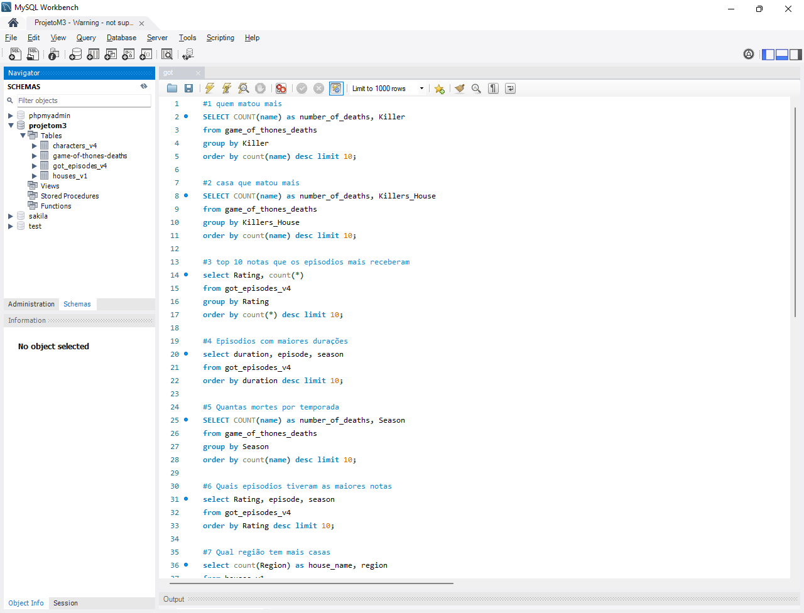
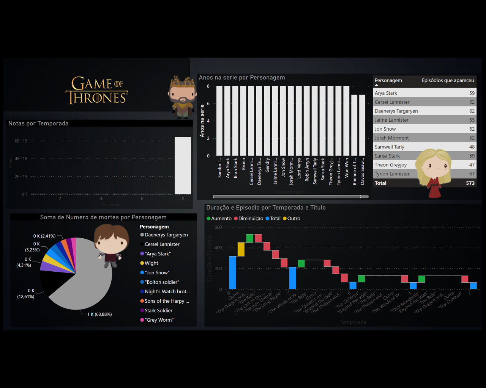
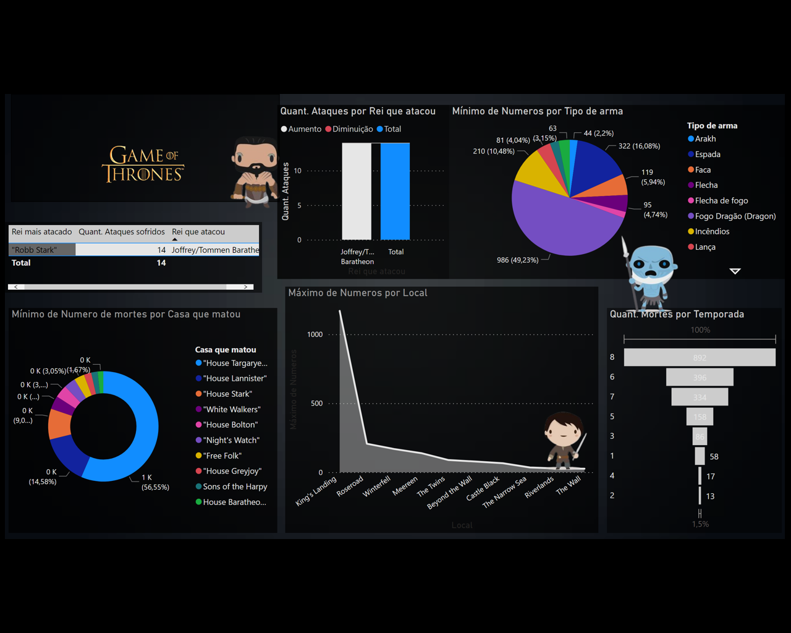
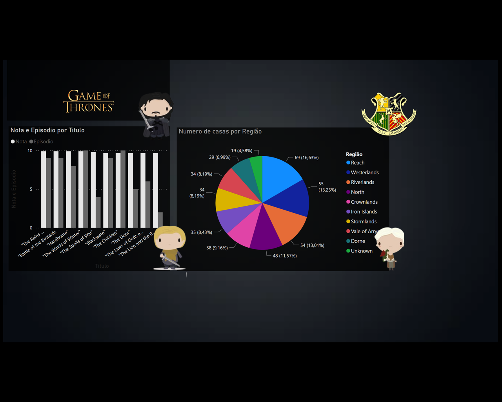

##
# 🤴 Participantes do Projeto👸

* ### Emilly <a href="https://www.linkedin.com/in/emilly-finco/" target="_blank">Linkedin <a href="https://github.com/Emillycristina" target="_blank">Github</a>
 
* ### Felipe <a href="https://www.linkedin.com/in/felipenascto/" target="_blank">Linkedin </a> <a href="https://github.com/felipenascto7" target="_blank">Github</a>
 
* ### Lucas <a href="https://www.linkedin.com/in/lucascalebe/" target="_blank">Linkedin </a> <a href="https://github.com/lccalebe" target="_blank">Github</a>
 
* ### André <a href="https://www.linkedin.com/school/resilia-educacao/" target="_blank">Linkedin </a> <a href="https://github.com/ardomingos" target="_blank">Github</a>

  
# 🐉 Game of Thrones 🐉 - Módulo 3 Resilia Educação 🐉

<a href="https://www.resilia.com.br">Resilia Educação</a>

##
  
> ## 🧾 MYSQL Workbench - Database 🧾
> 
>
>
Dentro do MySQL, nosso grupo utilizou o que foi ensinado durante o módulo para criar e desenvolver as requisições das querys do nosso projeto. Assim, de acordo com o que foi feito no MySQL, passamos direto para o Power BI.
 
>

##

  
##

> ## 📊 Gráficos realizados no Power BI 📊
>
> 
>
>
>
>
Nosso grupo utilizou o POWER BI como ferramenta de criação dos gráficos retirados das querys  feitas dentro do MySQL para referenciar o que utilizados no projeto.

>

